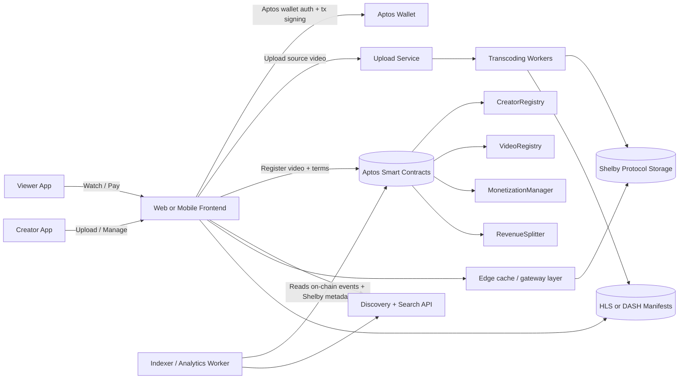

# NetworkNeuron — The Open Video Network

> A decentralized streaming protocol + app where creators own their audience, content, and revenue.

NetworkNeuron is a censorship-resistant, creator-first platform inspired by Vimeo, rebuilt with decentralized video storage through **Shelby Protocol** and on-chain monetization on the **Aptos blockchain**.

---

## Why NetworkNeuron Exists

Today, creators face:

- Sudden demonetization and opaque payout rules.
- Platform lock-in and algorithm dependence.
- High platform fees and weak ownership portability.

NetworkNeuron flips that model:

- **Content ownership**: creators keep wallet-native ownership records.
- **Transparent payouts**: monetization logic is auditable on-chain.
- **Portable identity and catalog**: open metadata and indexers.
- **Censorship resistance**: durable decentralized media storage and verifiable references.

---

## Product North Star

Build a video ecosystem where creators can:

1. Publish high-quality video with decentralized storage guarantees via Shelby Protocol.
2. Monetize with subscriptions, pay-per-view, direct tips, and token-gating.
3. Configure programmable revenue splits for teams/collaborators.
4. Build direct audience relationships without centralized gatekeepers.

---

## 🗺️ Working Map (System + Execution)

## 1) System Map (How the platform works end-to-end)

## 2) Build Map (What to build first)

| Phase | Goal | Deliverables | Exit Criteria |
|---|---|---|---|
| **P0: Aptos + Shelby Foundation** | Prove creator ownership and decentralized storage | Aptos wallet auth, upload pipeline, Shelby video persistence, on-chain registration | Creator uploads and plays video with Aptos ownership record + Shelby storage proof |
| **P1: Monetization** | Enable creator revenue | Tips, subscription logic, payout split contract + receipts | Creator receives auditable Aptos payouts |
| **P2: Scale UX** | Improve performance and discoverability | Adaptive bitrate streaming, search, channels, playlists, caching strategy | Stream startup and buffering KPIs meet target SLO |
| **P3: Ecosystem Governance** | Expand trust minimization | Governance parameters, community moderation lists, open discovery modules | Core policy updates can be community-governed |

## 3) Creator-to-Cash Flow Map

1. Creator uploads a source file from the app.
2. Transcoder outputs multiple renditions + playback manifest.
3. Renditions/manifests are persisted through Shelby Protocol.
4. `VideoRegistry` records ownership + storage references + licensing.
5. Viewer pays via tip/subscription/PPV transaction on Aptos.
6. `MonetizationManager` routes funds via `RevenueSplitter`.
7. Dashboard displays indexed events for near real-time, auditable earnings.

---

## Architecture Blueprint (Shelby + Aptos)

### Client Layer

- Web/mobile apps for upload, discovery, playback, and creator analytics.
- Aptos-compatible wallet authentication and transaction signing.
- Optional gas and onboarding abstractions for non-crypto-native users.

### Media Layer (Shelby Protocol + Processing)

- Source uploads are transcoded into adaptive renditions (1080p/720p/480p).
- HLS/DASH manifests are generated for resilient playback.
- Canonical content references map to Shelby-stored media objects.
- Redundancy and retrieval strategy built around Shelby persistence guarantees.

### Contract Layer (Aptos)

- **CreatorRegistry**: wallet → creator/channel metadata.
- **VideoRegistry**: ownership, storage reference, publish status, licensing/provenance.
- **MonetizationManager**: subscriptions, PPV, tips, access checks.
- **RevenueSplitter**: programmable payouts for collaborators.
- **Governance (optional)**: protocol fee parameters and module approvals.

### Data & Discovery Layer

- Indexer consumes Aptos events and Shelby-related metadata pointers.
- Query API powers feeds, creator pages, search, and analytics.
- Open indexing model supports alternative indexers and anti-centralization.

### Performance Layer

- Edge cache and gateway routing for low-latency video delivery.
- Multi-path retrieval strategy to improve playback reliability.

---

## Monetization Modes

- **Subscriptions**: recurring fan support for premium catalogs.
- **Pay-per-view**: one-time unlock for premium content.
- **Direct Tips**: instant viewer-to-creator value transfer.
- **Token-Gated Access**: token ownership unlocks private videos.
- **Collaborator Splits**: automatic payout sharing across contributors.

---

## Trust, Safety, and Moderation (Layered Model)

NetworkNeuron is censorship-resistant, not moderation-free.

- **Protocol layer**: neutral ownership and payment records.
- **Application layer**: policy controls, region handling, and safety defaults.
- **Community layer**: moderation lists and transparent reputation signals.
- **User layer**: personal filter controls and subscribed policy lists.

---

## MVP Scope

### In Scope (MVP)

- Aptos wallet sign-in and creator profile setup.
- Video upload + Shelby persistence + on-chain registration.
- Playback through gateway/edge path with adaptive manifests.
- Creator catalog page.
- Direct tipping with on-chain receipt.

### Out of Scope (MVP)

- Full DAO governance.
- Advanced recommendation engine.
- Multi-chain bridging.

---

## Success Metrics (First 6 Months)

- **Creator activation**: % of creators who publish at least one video.
- **Revenue flow**: Aptos payout volume and creator take rate.
- **Playback quality**: startup time, buffering ratio, completion rate.
- **Storage reliability**: % of videos meeting Shelby persistence/retrieval SLO.
- **Ownership integrity**: % of videos with complete on-chain ownership metadata.

---

## Risks and Mitigations

- **Storage/transcoding cost pressure**
  - Mitigate with tiered retention, encoding optimization, and quota policy.
- **Wallet UX friction**
  - Mitigate with guided onboarding, session keys, and simplified payment UX.
- **Indexer centralization risk**
  - Mitigate with open schemas and independently operable indexers.
- **Regulatory variability**
  - Mitigate through modular compliance controls at app layer.

---

## Suggested Implementation Sequence (Next 30 Days)

1. Define Aptos contract interfaces and Shelby reference schema.
2. Deploy `CreatorRegistry` and `VideoRegistry` on Aptos testnet.
3. Build upload + transcode + Shelby persistence pipeline.
4. Register storage references on-chain and verify playback resolution flow.
5. Implement direct tipping and payout split events.
6. Ship creator dashboard v0 with earnings and storage status timeline.

---

## Long-Term Vision

NetworkNeuron evolves from a single app into an open creator-owned video protocol where multiple clients can compete on UX while sharing common Aptos ownership, monetization rails, and Shelby-backed media infrastructure.
