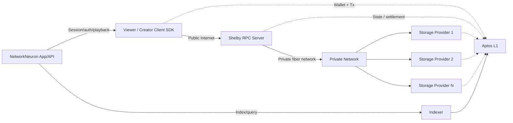
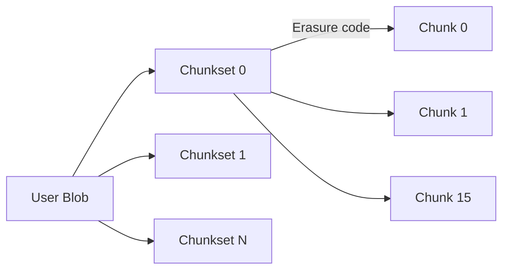
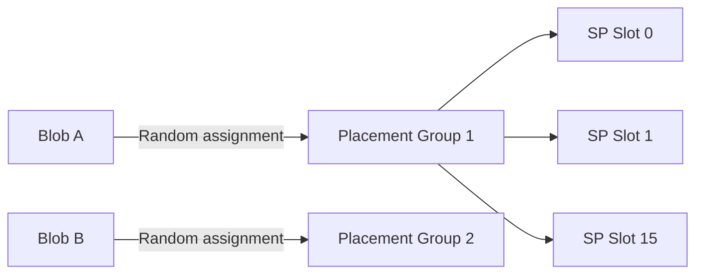
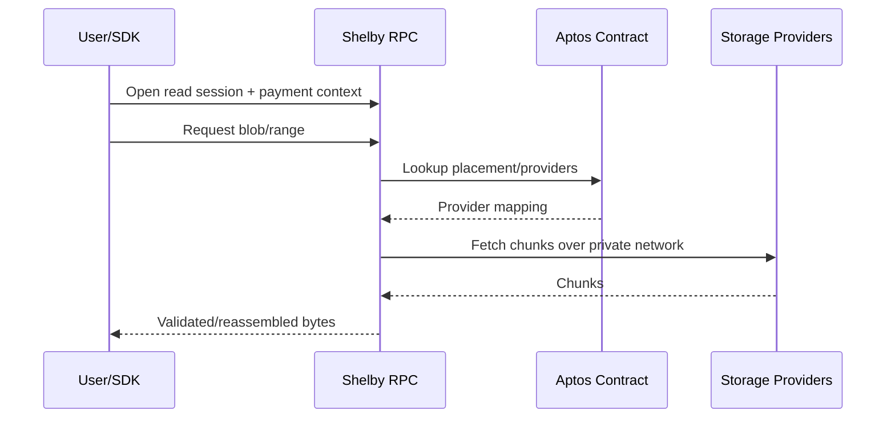
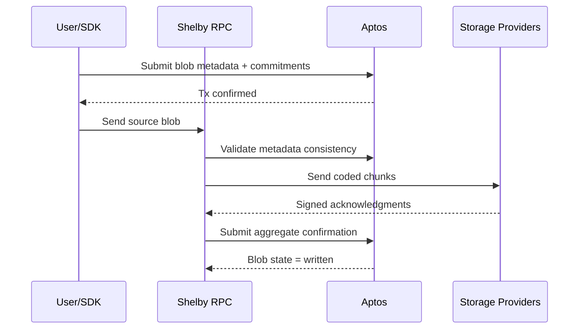

# NetworkNeuron — Creator-Owned Video on Shelby + Aptos

> A decentralized streaming platform where creators keep ownership, control monetization, and deliver high-performance video using Shelby Protocol.

NetworkNeuron is a censorship-resistant, creator-first video platform inspired by Vimeo, built on:

- **Shelby Protocol** for high-performance decentralized blob storage.
- **Aptos** for coordination, settlement, payment logic, and correctness-critical state.

---

## Why This Stack

Video streaming, AI, and analytics workloads need:

- Robust storage durability.
- High read throughput.
- Predictable latency.
- Transparent economics.

Shelby is purpose-built for demanding read-heavy workloads and aligns with NetworkNeuron’s requirements:

1. **Paid reads and user-focused incentives**
   - Read payments incentivize providers to deliver quality service.
2. **Aptos coordination + settlement layer**
   - Smart contracts manage state, payments, and correctness-critical workflows.
3. **Dedicated private bandwidth**
   - Shelby RPC and storage providers communicate over private fiber for consistent performance.
4. **Novel auditing system**
   - Supports integrity guarantees and rewards honest participation.
5. **Efficient erasure coding**
   - Strong durability with better recovery bandwidth economics.
6. **Built by experienced teams**
   - High-performance systems background from Jump Trading Group + Aptos teams.

---

## Product North Star

Build an open video ecosystem where creators can:

1. Upload and stream high-quality video with decentralized persistence.
2. Own content and rights via on-chain records.
3. Monetize with subscriptions, tips, pay-per-view, and split payouts.
4. Reach audiences without centralized platform lock-in.

---

## 🗺️ Working System Map



### Key Shelby Components

1. **Aptos Smart Contract**
   - Tracks system state and correctness-critical operations (including auditing-related flows).
2. **Storage Provider (SP) Servers**
   - Store chunk data and serve reads.
3. **Shelby RPC Servers**
   - Entry point for client SDK reads/writes; bridge public internet to private data path.
4. **Private Network**
   - High-performance connectivity between RPC servers and storage providers.

---

## Accounts, Namespaces, and Blob Naming

Shelby organizes blobs in **user-specific namespaces**:

- Namespace is derived from the user’s Aptos account hex address.
- Blob names are user-defined and must be unique within the namespace.
- Blob names may be up to 1024 characters and must not end with `/`.

Example fully-qualified blob:

```text
0x123.../videos/channel-a/episode-01.mp4
```

There are no true directories—only blob names. This means both of the following can exist simultaneously:

- `<account>/foo`
- `<account>/foo/bar`

For predictable recursive tooling behavior, use canonical path-like naming conventions.

---

## Data Model: Chunking + Erasure Coding

Shelby stores data using erasure-coded chunksets:

- Blobs are split into fixed-size **chunksets**.
- Each chunkset is encoded into **16 chunks total**:
  - 10 data chunks
  - 6 parity chunks
- Current conceptual sizing:
  - 10 MB user-data chunkset
  - 1 MB per chunk



Recovery properties:

- Any 10 of 16 chunks can reconstruct data.
- Clay-code-based repair can reduce recovery traffic versus standard Reed-Solomon approaches.

---

## Placement Groups (PGs)

Shelby assigns each blob to a placement group to keep metadata efficient and improve operational scalability:

- Each PG has **16 slots**, matching the 16-chunk coding layout.
- All chunks for a blob are mapped to the same PG’s SP set.
- This avoids storing per-chunk location metadata on-chain.



---

## Read Procedure (Shelby-Aligned)

1. Client SDK selects an available Shelby RPC server.
2. Client establishes payment/session context.
3. Client requests blob or byte range with payment authorization.
4. RPC optionally serves from cache.
5. RPC consults Aptos contract state for placement/provider mapping.
6. RPC fetches required chunks from SPs over private network and pays via read payment mechanism.
7. RPC validates chunks, reassembles response bytes, returns data.
8. Session remains reusable for additional reads with incremental payments.



---

## Write Procedure (Shelby-Aligned)

1. Client selects Shelby RPC server.
2. SDK computes erasure-coding/chunk commitments locally.
3. SDK submits Aptos transaction with blob metadata + commitment root; storage payment handled on-chain.
4. SDK sends source data to RPC.
5. RPC recomputes/validates coded representation against on-chain metadata.
6. RPC distributes chunks to assigned SPs by placement group.
7. SPs validate chunks and return signed acknowledgments.
8. RPC aggregates acknowledgments and submits confirmation transaction.
9. Contract marks blob as written/durable.



---

## NetworkNeuron Application Architecture

### Client Layer

- Web/mobile clients for upload, playback, discovery, and creator dashboard.
- Aptos wallet auth and transaction signing.
- SDK-driven reads/writes through Shelby RPC endpoints.

### Contract Layer (Aptos)

- **CreatorRegistry**: creator/channel identity metadata.
- **VideoRegistry**: ownership, rights, Shelby blob references, publish state.
- **MonetizationManager**: subscriptions, PPV, tips, entitlement checks.
- **RevenueSplitter**: programmable payouts for collaborators/partners.

### Index & Discovery Layer

- Indexer reads Aptos events and app metadata.
- Search/discovery APIs power feeds, channel pages, and analytics.

### Delivery Layer

- Shelby RPC path for durable source-of-truth retrieval.
- Optional cache/gateway layer for startup latency improvements.

---

## Monetization

- **Subscriptions**
- **Pay-per-view**
- **Direct tips**
- **Token-gated access**
- **Revenue splits**

Design principle: creator earnings should be transparent, auditable, and programmable.

---

## MVP Scope

### In Scope

- Aptos wallet login and creator profile.
- Video upload pipeline with Shelby persistence.
- On-chain `VideoRegistry` records pointing to Shelby blobs.
- Playback path via Shelby RPC.
- Tip transactions and receipt visibility.

### Out of Scope (MVP)

- Full governance DAO.
- Advanced recommendation ML ranking.
- Multi-chain interoperability.

---

## Success Metrics

- Creator activation rate.
- On-chain payout volume and creator take-rate.
- Stream startup time and buffering ratio.
- Shelby retrieval success/SLO adherence.
- % of videos with complete ownership + rights metadata.

---

## 30-Day Implementation Map

1. Finalize Aptos Move contract interfaces and event schema.
2. Define Shelby blob naming convention and metadata mapping format.
3. Implement upload → write-confirmation flow (including on-chain state transitions).
4. Implement playback read-session flow with usage metering.
5. Ship creator dashboard with earnings + storage/read health telemetry.
6. Run load tests on read-heavy playback scenarios.

---

## Long-Term Vision

NetworkNeuron becomes an open creator-owned media protocol where multiple apps can compete on UX while sharing a common trust layer:

- Shelby for scalable, performant decentralized storage.
- Aptos for settlement, incentives, and verifiable ownership/economics.
