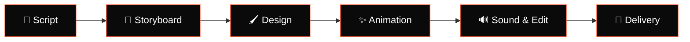

<picture>
  <source srcset="assets/hero-banner.gif" type="image/gif">
  
</picture>

### We turn complex ideas into video

2D animation, motion graphics, explainer videos and post-production — for brands, startups and agencies worldwide.

## 🎬 What we do

<table>
<tr valign="top">
<td width="50%">

### ✏️ 2D Animation

Frame-by-frame character animation and vector storytelling — mascots, ad series, logo stings and motion illustration, handled from storyboard to final render.

</td>
<td width="50%">

### 📊 Motion Graphics

Kinetic typography, data and UI motion, brand systems and social cutdowns that make a message move without losing the message.

</td>
</tr>
<tr valign="top">
<td width="50%">

### 💡 Explainer Videos

Clear, engaging video that simplifies a complex product and turns viewers into customers — script, storyboard, animation, voice and sound.

</td>
<td width="50%">

### 🎞️ Video Editing

Post-production, colour, sound and delivery — including scroll-stopping cutdowns sized for Instagram, TikTok, YouTube and paid campaigns.

</td>
</tr>
</table>

**[See the full service breakdown →](https://www.networkneuron.com/services)**

## ▶️ Showreel

A live-action and 2D stickman explainer produced end to end — script, animation, edit and sound — showing how we turn a complex idea into video.

## 🧭 How a project runs

```mermaid
flowchart LR
    A["📝 Script"] --> B["🎨 Storyboard"]
    B --> C["🖌️ Design"]
    C --> D["✨ Animation"]
    D --> E["🔊 Sound &amp; Edit"]
    E --> F["🚀 Delivery"]

    classDef s fill:#0A0A0A,stroke:#FF643D,color:#ffffff
    class A,B,C,D,E,F s
```

One team from first call to final master — no handing your project between vendors halfway through.

## 💻 On the engineering side

We build and run our own platform rather than renting one. [networkneuron.com](https://www.networkneuron.com) is a single React application carrying the public studio site *and* the internal system we use to run the studio — clients, projects, deadlines, invoicing, payroll and campaigns — on Postgres with row-level security and edge functions.

## 📬 Work with us

Got a product that is hard to explain, a launch that needs motion, or footage that needs finishing? Tell us what you are making.

| | |
|---|---|
| 🌐 **Site** | [www.networkneuron.com](https://www.networkneuron.com) |
| ✉️ **Email** | [networkneuronn@gmail.com](mailto:networkneuronn@gmail.com) |
| 💬 **Brief us** | [networkneuron.com/contact](https://www.networkneuron.com/contact) |
| 📍 **Based in** | Bangladesh — working worldwide |

 

**Network Neuron** · 2D Animation · Motion Graphics · Explainer Video · Editing

